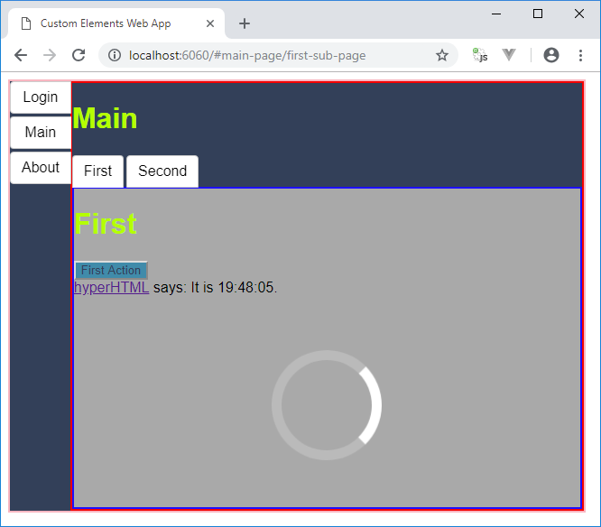

# web-components-es6-modules-app

This demo strives to answer the following question: What kind of application development is possible with today's browser capabilities?

The answer is: A lot! (btw. works best in Chrome ;-)

Everything that is expected for implementing single page application today (e.g. components and routing) is possible without a compilation process or any packaging (might in the future not even be necessary in case of HTTP/2 usage).
The only thing needed for running the application is a local HTTP server:
```
npm install http-server
http-server.bat
```

The demo application relies heavily on Web Components and ES6 modules.
It follows the application shell idea and lazy loads everything.
The loading is done by a small custom `Router.js` (~ 150 LOC) that uses dynamic ES6 imports and implicit routes derived from the page component names.
Asynchronous routing allows to perform e.g. HTTP request for every page displayed in a route.

Web Components are used for widgets as well the pages (pages in second level of hierarchy are called sub-pages).
A main goal for the pages and sub-pages is that they are as local as possible to avoid side-effects across the application (in terms of code changes as well in terms of application state).
They are responsible for their own JavaScript, HTML and CSS.
The only outside thing they know are the names and API of their children and some CSS variables for theming.



The widgets are partially (very simple) own ones or from [Elix](https://component.kitchen/elix).

Currently there are three different styles of components:
- standard one is separate JavaScript, CSS and HTML template file (HTML templated is loaded via `fetch` API)
- [hyperHTML](https://github.com/WebReflection/hyperHTML) with inline String Templates
- [Preact](https://github.com/developit/preact) virtual DOM rendering with programmatically used JSX factory

The ES6 modules allow scoping of JavaScript and easy mixing of different approaches like hyperHTML and Preact (depending on the requirements of the component).
CSS is scoped by Web Components and there is a shared ```theme.css``` for overall styling.

Bottom line is, that a lot is possible already today.
The advantage of such an approach is that there is no framework lock-in.
New browser features can be used whenever they are needed.
Addition libraries can be dropped in without affecting the other parts of the application.

Disadvantage is definitively the lack of a framework (sounds ironic) because a lot care must be invested to make sure that the structure of the application does not deteriorate over time.
This includes the introduction of new concepts whenever they appear (instead of local solutions for a more generic problem).